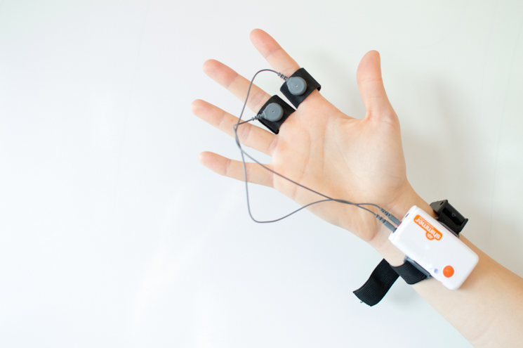
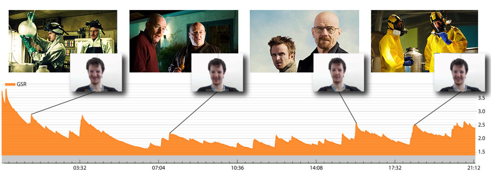

## TechGig CodeGladiators 2020

This repository contains solutions to TechGig CodeGladitors contest. Code Gladiators is an annual coding competition by TechGig, that draws the best and the brightest coding talent from all over India. With multiple contests in emerging technologies and the coveted title of Code Gladiators up for grabs, the competition sees enthusiastic participation and has grown from strength to strength with each passing year. In the initial Open Coding Round, there have been 6458 registrations at the time of this writing.
I tried organizing this repository neatly into folders, but I removed them later because Git does not track directories on their own. So I will try to be as descriptive as possible in the README.md and in the code comments.

The first round is an Open Coding Round, where we had to solved two problems which we can solve with whatever langauage of choice (I used Python and C++):

1. Powerpuff Girls 
2. BeyBlade Tournament

The second round has three levels in which we have to demonstrate our expertise in Cloud using the Microsoft Azure Platform:

1. Screening Level
2. Online Hackathon
3. Offline Hackathon

In the first level, we have to register an account on Microsoft Azure and submit a valid screenshot showing that you have taken the necessary steps. In the second level, we have to solve the problem statement given in the Azure Platform and submit the source code as well as a readme.txt and presentation showing the functionalities of your application, the problem it solves and why it should be considered for the final round. Me and my teammate Mohan are planning on building an application that measures GSR (Galvanic Skin Response) in corporate employees to monitor stress levels using a sensor and use Azure Cloud to store our data as well as gain insights using Machine Learning.

Our body has about three million sweat glands. The density of sweat glands varies markedly across the body, being highest on the forehead and cheeks, the palms and fingers as well as on the sole of the feet.
Whenever sweat glands are triggered and become more active, they secrete moisture through pores towards the skin surface. By changing the balance of positive and negative ions in the secreted fluid, electrical current flows more readily, resulting in measurable changes in skin conductance (increased skin conductance = decreased skin resistance). This change in skin conductance is generally termed Galvanic Skin Response or GSR.

GSR falls under the umbrella term of electrodermal activity, or EDA which refers to changes in sweat gland activity that are reflective of the intensity of our emotional state, otherwise known as emotional arousal. Our level of emotional arousal changes in response to the environment we’re in – if something is scary, threatening, joyful, or otherwise emotionally relevant, then the subsequent change in emotional response that we experience also increases eccrine sweat gland activity. We don‘t need to be sweat-flooded in order to see differences in electrodermal activity (in fact, the sweating doesn’t even need to be visible). It is noteworthy that both positive (“happy” or “joyful”) and negative (“threatening” or “saddening”) stimuli can result in an increase in arousal – and in an increase in skin conductance. 

Psychological studies utilize Galvanic Skin Response to identify how humans respond emotionally towards various stimuli and how these responses are affected by stimulus properties (color, shape, duration of presentation), personality characteristics (extroverts vs. introverts), social expectancies (“men are not emotional”), and the interaction of cultural aspects and individual learning histories. Clinical populations such as patients suffering from eating disorders, phobias or post-traumatic stress syndrome (PTSD) show heightened fear responses and emotional arousal to trauma reminders. Evaluating consumer preferences is a critical element of marketing. GSR can be measured to track emotional arousal towards products with high consumer interest, however only subtle differences in terms of performance and quality. Even in media research, campaign material such as TV ads, trailers, and full-length shows can be shown to individual participants or focus groups while monitoring their emotional arousal based on GSR measurements.

The GSR signal is therefore not representative of the type of emotion, but the intensity of it. While sweat secretion plays a major role for thermoregulation and sensory discrimination, changes in skin conductance are also triggered robustly by emotional stimulation: the higher the arousal, the higher the skin conductance. Skin conductance is not under conscious control. Instead, it is modulated autonomously by sympathetic activity which drives aspects of human behavior, as well as cognitive and emotional states. Skin conductance therefore offers direct insights into autonomous emotional regulation. Researchers focus on the latency and amplitudes of the phasic bursts with respect to stimulus onset when investigating GSR signal changes in response to sensory stimuli (images, videos, sounds). By using the skin conductance values, or the number of GSR peaks, it’s possible to add quantitative data to studies of emotional arousal. With more data at hand, it’s easier to uncover new findings, and make new discoveries about human behavior.

